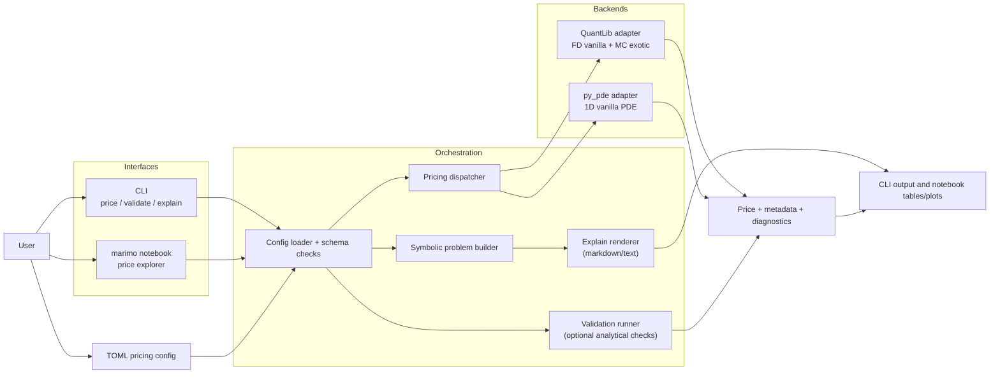
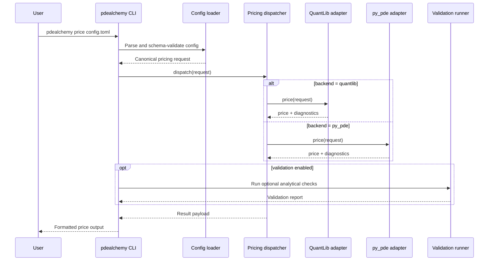

# PDEAlchemy
PDEAlchemy is a CLI-first framework for pricing financial options with PDE solvers, starting from transparent TOML configurations.
Abbreviation: `PDA` (pronounced “pee-dee-ay”), with a playful nod to “Personal Digital Assistant”.

## Current Status
Initial project skeleton is in place, including:
- `uv`-managed Python project configuration
- `just` task automation
- CLI scaffold (`price`, `validate`, `explain`)
- Base logging and error handling modules
## Solution Overview Diagram


### Pricing Execution Flow


## Quick Start
```bash
uv sync --all-extras --dev
just test
uv run pdealchemy --help
```

## Canonical Examples
- Vanilla: `examples/vanilla_european_call.toml`
- Exotic (discrete Asian + barrier + dividends): `examples/exotic_discrete_asian_barrier_dividend.toml`
- Vanilla with market curve/surface inputs: `examples/vanilla_market_curve_surface.toml`

## CLI Examples
```bash
uv run pdealchemy validate path/to/config.toml
uv run pdealchemy explain path/to/config.toml --format markdown
uv run pdealchemy validate path/to/config.toml --analytical --tolerance 0.75
uv run pdealchemy validate path/to/config.toml --equation-library library
uv run pdealchemy price path/to/config.toml
```

Convenience `just` recipes for the main workflows:
```bash
just price
just validate
just explain
```

## Market Curves and Surfaces
QuantLib vanilla pricing routes can now consume optional market structures from TOML:
- Flat or node-based zero-rate curves for risk-free and dividend term structures
- Constant volatility, volatility term curves, or volatility surfaces

See `examples/vanilla_market_curve_surface.toml` for a complete configuration.

Current limitation:
- Exotic Monte Carlo routes currently require flat curves and constant volatility.
- `py_pde` backend currently supports 1D vanilla European routes (no exotic features).

## marimo Notebook Explorer
An interactive marimo notebook example is available at `examples/notebooks/price_explorer.py`.
It now includes:
- side-by-side vanilla pricing comparison across QuantLib and `py_pde`,
- finite-difference Greeks estimates,
- Plotly charts for backend price comparison and spot-sweep sensitivity.

Launch it with either command:
```bash
just notebook
```

```bash
uv run marimo edit examples/notebooks/price_explorer.py
```

Run it in app mode:
```bash
just notebook-run
```

Quick notebook static check:
```bash
just notebook-check
```

`just notebook-run` starts a server and keeps running until interrupted. Exiting with Ctrl-C returns code `130`, which is expected behaviour.

## Notebook-driven specification workflow
PDEAlchemy also supports notebook-first specification authoring with semantic cell names:
- Template: `templates/spec_template.py`
- Example notebook: `examples/notebooks/spec_black_scholes.py`
- Equation library root: `library/`

Convert a specification notebook into TOML:
```bash
uv run pdealchemy notebook-to-toml examples/notebooks/spec_black_scholes.py --output examples/notebooks/spec_black_scholes.toml --overwrite
```

Or use the just recipe:
```bash
just notebook-to-toml
```

## Lint, Type Checks, and Pre-Commit
Ruff and ty are configured for progressive quality enforcement:
- Source code (`src/`) is checked for docstrings and type annotations.
- Tests are temporarily excluded from strict docstring/type-hint linting while coverage is improved incrementally.

Commands:
```bash
just lint
just typecheck
just test-cov
just check
```

Pre-commit setup:
```bash
just precommit-install
just precommit-run
```

## Validation Strategy
- Philosophy: `VALIDATION_PHILOSOPHY.md`
- Practical strategy and trust boundaries: `docs/validation_strategy.md`
- Black-Scholes-first testing path: `docs/black_scholes_first_workflow.md`
- Data source purpose and limitations: `docs/market_data_sources.md`

## Development Blog
The project now keeps a progressive engineering log under `docs/blog/`.

Start here:
- `docs/blog/README.md`
